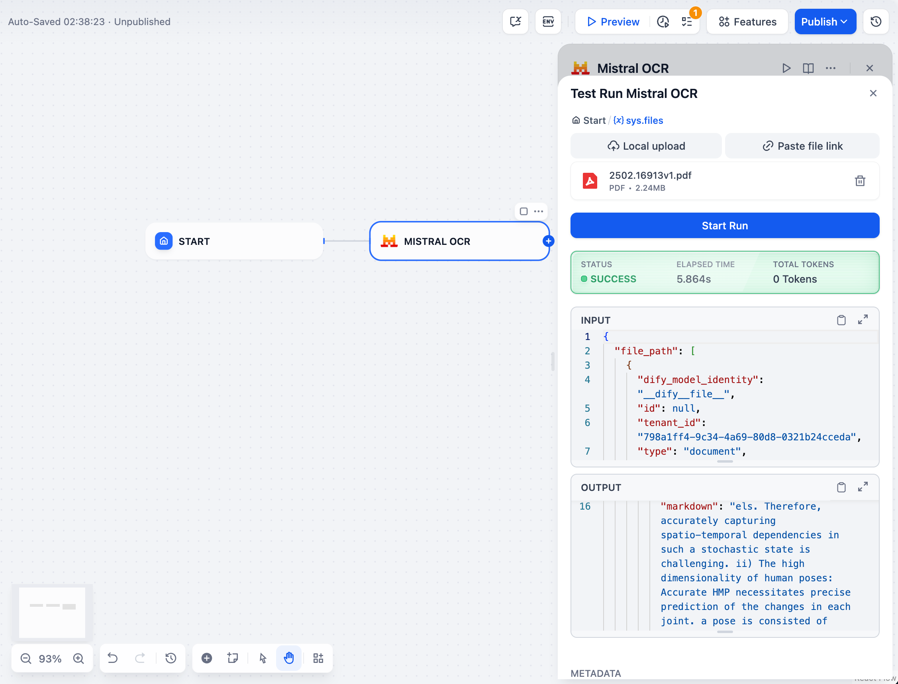

# Mistral OCR Plugin

This plugin integrates Mistral OCR capabilities into Dify, allowing you to extract text and structured content from PDF documents and images with high accuracy and formatting preservation.

## Features

- Extract text while preserving structure and formatting (headers, paragraphs, lists, tables)
- Return results in markdown format
- Handle complex layouts (multi-column text, mixed content)
- Process various formats (PDF, images) with high accuracy

## Setup

1. Get your Mistral API key from [Mistral AI Console](https://console.mistral.ai/api-keys/)
2. Configure the plugin with your API key in the credentials section
3. Use it in your Dify Agent, Chatflow, and Workflow.

## Usage

The Mistral OCR tool can process documents in two ways:

1. **File Upload**: Upload PDF documents or images directly through the Dify interface
2. **URL Processing**: Process documents from publicly accessible URLs

### Parameters

- `file`: Upload a file for OCR processing. Supports PDF documents and common image formats
- `pages`: Specific pages to process (e.g., "0,2,4-7"). For PDF documents only (default: "0")
- `image_limit`: Maximum number of images to extract from the document (optional)
- `image_min_size`: Minimum size threshold for extracting images in pixels (default: 100)

## Examples

### Processing a PDF document

Upload a PDF or enter the PDF URL through the Dify interface and configure the following parameters:

### Processing an image

Simply upload an image or provide a URL through the Dify interface without needing to configure any additional parameters.

## Response

The tool returns OCR results in JSON format that includes:

- **Pages**: Array of page objects with extracted text in markdown format
- **Images**: Any images extracted from the document (if applicable)
- **Document structure**: Information about the document structure and layout
- **Formatting**: Preserved formatting elements like headings, paragraphs, and tables

## Privacy

This plugin processes your documents according to our [Privacy Policy](./PRIVACY.md). Your files are processed temporarily and are not stored permanently by the plugin.

## Contact

For questions, feedback, or support regarding the Mistral OCR plugin, please contact the author:

**Leillei**  
📧 jeroen20211101@gmail.com
